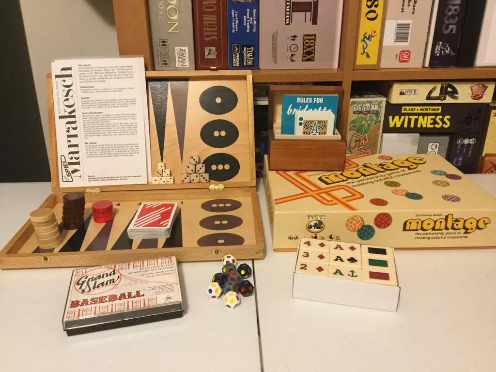

[Prince Joli Quentin Kansil](https://en.wikipedia.org/wiki/Joli_Quentin_Kansil) was a renaissance man amongst game designers. A world traveler by desire, his roots (when he planted them) were in Philippines as an English teacher. I'd like to think that his designs are the kinds of games that might have been invented by "the most interesting man in the world." In addition to designing games, he was also a board game publisher, an accomplished Bridge and Backgammon player and promoter, a teacher, an author, an [inventor of alternative alphabets and calendars](http://web.archive.org/web/20060710031108/http://www.indochinegame.com/board_games/other_projects.html), a restless traveler, and a member of Hawaiian royalty by marriage. To those who knew him and corresponded with him, he was generous with his time and thoughtful in his interactions.

Joli Quentin Kansil passed away on March 27th, 2023 -- two months after his 80th birthday.

Kansil's design are quaint by the standards of modern design and are closer to traditional pub games than the games that flood the Kickstarter scene, but I always admired their ingenuity and drew deep inspiration from them for my own (occasional) designs. In this post, I'll run through some of the games that I've played as an homage to a designer whose like we will never see again.

## Bridgette

[Bridgette](https://boardgamegeek.com/boardgame/2758/bridgette) is a Bridge variant for two-players and one of the few games inducted into the [Games Magazine Hall of Fame](https://web.archive.org/web/20100417062722/http://www.gamesmagazine-online.com/gameslinks/hallofame.html). Bridgette was admired among hobby game designers (Alan Moon was once a huge fan) and Bridge players alike. If there is a game that could pair well with scotch then Bridgette is that game. There have been many variants over the years, but the pinnacle of 2-player Bridge is realized in the "Bridgette Showdown" edition, which was the last commercial release. Bridge players know that the depth of game-play comes in the meta-language of bidding and the way that players use it to garner information about opponent and partner hands. The real depth of Bridge comes in the form of Duplicate play where teams all play with the same prefab hands and try to best each other's score with them. Having experienced Duplicate play first-hand I'll say that it's tense and riveting in all the right ways. Bridgette cannot duplicate that particular aspect of Bridge, but it does a fantastic job of retaining a language of hand exposure in ways that no other 2-player Bridge that I've played before or since discovering Bridgette.

## Krakatoa 

[Krakatoa](https://boardgamegeek.com/boardgame/1306/krakatoa) is an odd dice game with set collection and a dexterity element where players throw dice to change the values of previously rolled dice and build scoring sets. The idea of crashing dice into other dice to change their values in hopes of scoring higher is indeed bonkers, but such a crazy activity is highly amenable to trash talking and friendly banter. You have to like dice games to enjoy this one and if you're interested then I recommend trying to find the 1st edition rules as they make for a more exciting game.

## Grand Slam Baseball

[Grand Slam Baseball](https://boardgamegeek.com/boardgame/4777/grand-slam-baseball) is a variation of [Sid Sackson's Card Baseball](https://boardgamegeek.com/boardgame/21682/card-baseball) that uses the trick-taking resolution and simultaneous reveal from Marrakesh to determine player outcomes.

## Solitaire for Two

[Solitaire for Two](https://boardgamegeek.com/boardgame/2602/solitaire-two) is a variant of Klondike, but with six suits and beautifully clickty-clacking tiles.

## Montage

It took me forever to finally get 4-players able and willing to play [Montage](https://boardgamegeek.com/boardgame/5243/montage), but when it finally happened it was a hit. Like most JQK games, Montage is quirk-city to the max. The idea is that you're using a symbolic language of colors to signal to your teammate a secret word without providing too much information that the other team will know what the word is. It's weird... but it works! The game was eventually reworked into a game called [¡Knock-on-Word!](https://boardgamegeek.com/boardgame/4072/knock-word) that uses many of the same principles but with more streamlined play.

## What's My Word

[What's My Word](https://boardgamegeek.com/boardgame/4079/whats-my-word) is a near perfect word deduction game that's reminiscent of Mastermind but not prone to killer tactics. The game is clearly a predecessor to the ever-popular Wordle.

## Marrakesh 

Finally, [Marrakesh](https://boardgamegeek.com/boardgame/685/marrakesh) is the strangest Kansil design of all, and the most inspiring to me. This is a distillation of Backgammon's bearing off phase, with bluffing, trick-taking, and memory involved. The game centers around the Backgammon mechanic of bearing off pieces but mixes in a simultaneous trick-taking element to resolve play and set the bounds of possible maneuvering. The matches start quite random with some wild swings, but as the match progresses you start to gain more information about the cards left in play. I really like that about the game. Marrakesh is truly an oddball game, but I find it quite endearing. Indeed, the premise sounds like a bizarre Frankenstein's Monster... and it is... but that's not a bad thing. My favorite aspect is the gradual revelation of the contents of the draw deck as rounds are played. This is something that I have tried to emulate in some of my own card game designs.

Joli Quentin Kansil was a truly unique game designer and free-thinker and I think that he would have fit right into the guest lineup of the old Art Bell Show. The world lacks truly unique people and as a result is much the darker now that this shining light has left us.

:F
