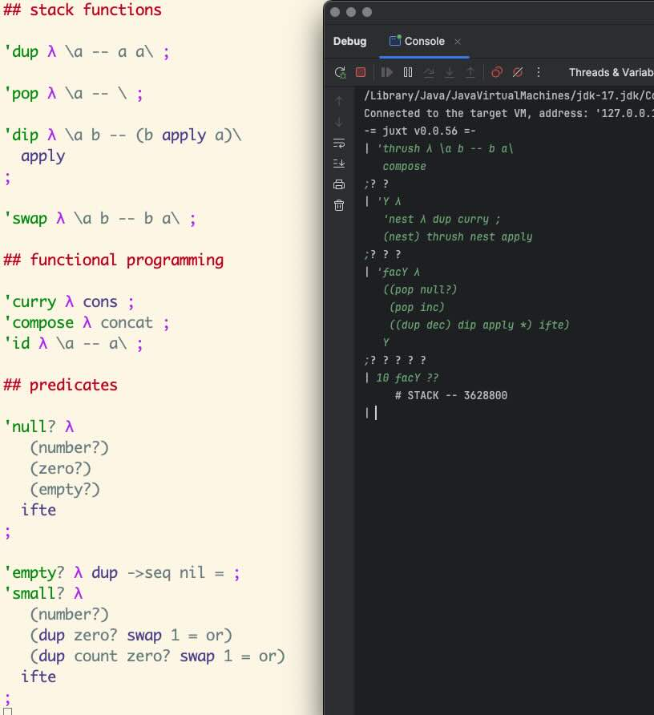

Great things and people that I discovered, learned, read, met, etc. in 2024.  No particular ordering is implied.  Not everything is new.

*also: see the lists from [2023](https://blog.fogus.me/2023/12/18/the-best-things-and-stuff-of-2023/), [2022](http://blog.fogus.me/2022/12/13/the-best-things-and-stuff-of-2022/), [2021](https://blog.fogus.me/2021/12/27/the-best-things-and-stuff-of-2021/), [2020](http://blog.fogus.me/2020/12/31/the-best-things-and-stuff-of-2020/), [2019](http://blog.fogus.me/2019/12/30/the-best-things-and-stuff-of-2019/), [2018](http://blog.fogus.me/2019/01/02/the-best-things-and-stuff-of-2018/), [2017](http://blog.fogus.me/2018/01/02/the-best-things-and-stuff-of-2017/), [2016](http://blog.fogus.me/2016/12/29/the-best-things-and-stuff-of-2016/), [2015](http://blog.fogus.me/2015/12/29/the-best-things-and-stuff-of-2015/), [2014](http://blog.fogus.me/2014/12/29/the-best-things-and-stuff-of-2014/), [2013](http://blog.fogus.me/2013/12/27/the-best-things-and-stuff-of-2013/), [2012](http://blog.fogus.me/2012/12/26/the-best-things-and-stuff-of-2012/), [2011](http://blog.fogus.me/2011/12/31/the-best-things-and-stuff-of-2011/) and [2010](http://blog.fogus.me/2010/12/30/the-best-things-in-2010/)*

## Great posts | articles | talks read/watched

* *[ELITE: The game that couldn't be written](https://www.youtube.com/watch?v=lC4YLMLar5I)* from Alexander the ok - *Elite was one of my favorite games on my Commodore 64 1,000,000 years ago and so I'm a sucker for articles on this gem. If you're interested, also check out [the annotated C64 source code](https://elite.bbcelite.com/c64/).* [^elite]
* *[The Rich History of Ham Radio Culture](https://thereader.mitpress.mit.edu/the-rich-history-of-ham-radio-culture/)* by Kristen Haring - *I missed out on the Ham radio craze and only recently learned about its rich history. This article is a good overview and starting point if you're interested in learning too.*
* *[Get to Know Your Japanese Bathroom Ghosts](https://www.atlasobscura.com/articles/japans-bathroom-ghosts)* by Eric Grundhauser - *Describes the interesting Japanese cultural folklore around bathroom ghosts.*
* *[The History of WordStar](https://www.abortretry.fail/p/arrogant-difficult-powerful)* by Abort Retry Fail LLC - *A great historical article about one of the most influential software suites ever created. Additionally, the comments are a goldmine of additional information and corrections and should not be skipped.*
* *[Combinatory Programming](https://blog.zdsmith.com/series/combinatory-programming.html)* by zdsmith - *Describes combinatorial programming using motivated examples -- a technique that's surprisingly scarce in articles about the topic.*
* *[Philip K. Dick’s Favorite Classical Music](https://www.openculture.com/2014/05/philip-k-dicks-favorite-classical-music.html)* by Open Culture - *Discusses PKD's love for classical music and the references to composers and their works in his fiction. The post also, includes an [11-hour classical music playlist](https://open.spotify.com/playlist/1RsnkX0bQWd2CVWW8jcxBR) for your listening pleasure.*
* *[Goodbye, Kory](https://new.wunderland.com/2024/11/20/goodbye-kory/)* by Andy Looney - *The world lost Kory Heath, a game designer whom I admire immensely. I've talked about his magnum opus [Zendo](https://blog.fogus.me/2014/10/23/games-of-interest-zendo/) on this blog before and have run numerous play sessions over the years. He was single-handedly responsible for hundreds of hours of enjoyment around my home and within my group of friends. The world is much the poorer without him in it. RIP.* [^chalker]

[^elite]: I also recommend and excellent YT video ["The Making of ELITE"](https://www.youtube.com/watch?v=GpWoF5uVgbA&t=529s).

[^chalker]: Dave Chalker also wrote about Kory on his blog at "[Remembering the Master: An Inelegant Eulogy for Kory Heath](https://critical-hits.com/blog/2024/11/20/remembering-the-master-an-inelegant-eulogy-for-kory-heath/)".

## Most viewed blog posts by me

* *[On method values, part 1](https://blog.fogus.me/2024/08/19/on-method-values-part-1/)* - *We released Clojure 1.12.0 this year and so I wanted to write about one of the features that I worked on. Method values are symbolic references to Java methods that can be used in value contexts and the design and implementation of this feature was interesting enough to talk about. The feature has been generally well received by the Clojure community.*

## Favorite technical (and technical-adjacent) books discovered (and read)

* *[And so FORTH](https://books.google.com/books/about/And_So_FORTH.html?id=iqUZAQAAIAAJ)* by Timothy Huang - *I found this long out of print Forth tome via inter library loan and enjoyed it immensely. It's a nice blend of the ideas in Brodie's [Thinking Forth](https://thinking-forth.sourceforge.net/) and something like Geere's [Forth: The Next Step](https://archive.org/details/forth-the-next-step-ron-geere). It was a sad day when I had to return this beauty back to the library because I could have used another read or two at least.*
* *[BASIC and FORTH in Parallel](https://www.amazon.com/BASIC-FORTH-Parallel-S-J-Wainwright/dp/0859341135?tag=fogus-20)* by S.J. Wainwright - *This style of book is exactly the kind of book that I would one day like to write. While the specifics of any such book would be different, the central conceit is perfect. That is, this book uses BASIC to create a simple stack machine and Forth interpreter and then presents simple Forth programs exercising them.*

## Favorite non-technical books read

* *[Butcher's Crossing](https://www.amazon.com/Butchers-Crossing-Review-Books-Classics/dp/1590171985/?tag=fogus-20)* by John Williams - *Follows Harvard drop-out Will Andrews as he escapes to the American frontier with a wad of cash to find adventure and "an original relation to nature". Andrews eventually finds Miller who is more than happy to help the young man part with his money in an attempt to find a hidden Colorado valley filled with buffalo that may or may not still (if it ever did) exist. The book follows Miller and Andrews' (plus a skinner Schneider and driver Hoge) trek throw the frontier and describes in harrowing detail their tribulations. I could not stop reading and finished the book in a weekend. This one demands multiple reads to really absorb the nuance.*
* *[The Spectral Link](https://www.amazon.com/Spectral-Link-Thomas-Ligotti-ebook/dp/B00LE52256/?tag=fogus-20)* by Thomas Ligotti - *Contains two stories by Ligotti: "Metaphysica Morum" and "The Small People". The first is quite different than most of Ligotti's work that I've read so far. It follows a self-described "metaphysical mutant" and blends overtly dark humor with an underlying pessimistic philosophy centered on a theme of euthanasia. "The Small People" is a dream-like exploration of paranoia and isolation. Both stories are a good introduction to the range in Ligotti's work if you're interested in checking him out.*
* *[The Corvo Cult](https://www.amazon.com/Corvo-Cult-History-Obsession-2014-10-09/dp/B01FIY47AQ/?tag=fogus-20)* by Robert Scoble - *Frederick Rolfe (aka Baron Corvo) was an little-known Edwardian author who is often remembered more for his bombastic personality than his fictional works. This book talks about the rise and growth of the still active "Corvo Cult" -- an obscure literary fandom. In many cases, Rolfe's fervid devotees matched the controversial author in eccentricity, but the true fascination lies in the broad range of people drawn to his eclectic works.*

## Number of books written or published

0

## Number of programming languages designed

0.5

## Favorite music discovered

* *[The Paragons](https://www.youtube.com/watch?v=o6TI2FfqGJ8&pp=ygUOInRoZSBwYXJhZ29ucyI%3D)* - *At some point I became interested in the roots of ska and The Paragons were the best group that I discovered during my explorations.*
* *[That's All!](https://en.wikipedia.org/wiki/That%27s_All!) by Sammy Davis Jr. - *A fantastic performance from a master of the vocal form. The songs are brilliant but the banter between songs will keep me listening into the distant future.*

## Favorite films discovered

* *[Withnail & I](https://en.wikipedia.org/wiki/Withnail_and_I)* - *[Sam Aaron](http://sam.aaron.name/) recommended this film to me years ago but I only managed to watch it in 2024. It's a great example of a dry comedy following a couple of screw-ups and their misadventures.*
* *[Jodorowsky’s Dune](https://en.wikipedia.org/wiki/Jodorowsky%27s_Dune)* - *A documentary about the most influential film that never was.*
* *[Requiem for a Dream](https://en.wikipedia.org/wiki/Requiem_for_a_Dream)* - *I'm probably the last person in the world to watch this relentless survey of despair. Not for the faint of heart.*

## Favorite podcasts

* *[Will Radio](https://www.youtube.com/@WilliamEByrd)* - *Will Byrd started the year promising a KiloTube of videos (i.e. 1024 videos) in 2024 and it's been a blast following along! There's no one quite like Will and so any chance that I can get to experience more of him I will jump on.*
* *[Eros + Massacre](https://cinepunx.com/podcast-episodes/eros-massacre/)* - *Another podcast triumph by Samm Deighan surveying the weird world of psychotronic cinema.*

## Favorite programming languages (or related) I hacked on/with on my own time

* *[Joy](https://hypercubed.github.io/joy/joy.html)* - *Joy is a mindfrak of a programming language in the concatenative functional language family. The core of Joy is beautiful and among the foundational programming languages in my opinion.*
* *[Forth](https://www.forth.com/forth/)* - *Sticking with the concatenative family in 2024, I continued to explore Forth. Interestingly the language is incredibly rich in history and conducive to a wide range of techniques and paradigms. I'm unsure if I'll ever find the opportunity to use Forth in anger, but I will say that I should come out of my explorations a stronger programmer and program designer.*

## Programming languages used for work-related projects

* [Java](https://mail.openjdk.org/pipermail/amber-spec-experts/2023-December/003959.html) - *Working deep in the Clojure compiler means that much of my work in 2024 was in Java.*
* [Clojure](http://www.clojure.org) - *2024 marks the 15th year[^15th] as a full-time Clojure programmer and the 1st year as a full-time Clojure core developer.*
* [ClojureScript](http://www.clojurescript.org) - *Less-so now than when I was consulting full-time but I occasionally dig into explore the implications of changes to Clojure on CLJS.*
* [Datalog](http://www.datomic.com) - *The [Datomic](https://www.datomic.com/) flavor of Datalog is the flavor of choice for database access, be it in-process or in the cloud. Again, my day-to-day usage is limited, but I have my share of personal databases hosted on Datomic.*

[^15th]: This is strictly my work-life time. My total use of Clojure has been longer.

## Programming languages (and related) that I hope to explore more deeply

* *[Joy](https://hypercubed.github.io/joy/joy.html)* - *There's a mountain of deep information on Joy that I would like to devour in 2025.[^joy]*
* *[Mouse](https://en.wikipedia.org/wiki/Mouse_(programming_language))* - *Yet another concatenative language to explore that's long-dead but still has some lessons to teach one such as myself.*
* *[POP-11](https://poplogarchive.getpoplog.org/poplog.info.html)* - *Another dead language that was designed to support AI applications in the 70s and 80s. I love the idea of exploring the language and the suite of applications that built up around it.*

[^joy]: Sadly the death of Manfred von Thun brought the death of Joy with it. The literature the language is indeed deep but it's finite and has stopped growing entirely. I would like to help fix this stagnation if I can in 2025.

## Favorite papers discovered (and read)

* *[Recursion Theory and Joy](https://hypercubed.github.io/joy/html/j05cmp.html)* by Manfred von Thun - *Joy's underlying reliance on combanatory programming manifests deep in the language even to the degree that recursion in the language is implemented in userspace via recursive combinators. This paper describes the "Joy Way" and its relationship to recursion.*
* *[A Simple Applicative Language: Mini-ML](https://www.cs.tufts.edu/~nr/cs257/archive/dominique-clement/applicative.pdf) (PDF) by D. Clement and J. Despeyroux and T. Despeyroux and G. Kahn* - *Presents a beautiful definition of ML language and its compilation to an abstract machine.*

## Still haven’t read...

I Ching, A Fire upon the Deep, Don Quixote, and **[a boat-load of sci-fi](http://blog.fogus.me/2012/09/21/the-amazing-colossal-science-fiction-ketchup/)**

## Favorite technical conference attended

* *[Clojure/conj 2024](https://2024.clojure-conj.org/)* - *This was the first Clojure conference that I played a somewhat active part in organizing. Let me be clear, my part in the matter was minimal at best, but it did provide me a window into the complexities of organizing a conference. The conference itself was a blast and it was great to meet old and new Clojure friends as well as [colleagues](https://www.nubank.com)!*

## Favorite code read

* *[Restrained Datalog in 39loc](https://buttondown.com/tensegritics-curiosities/archive/restrained-datalog-in-39loc/)* by Christophe Grande - *I've learned over the years that if Christophe writes a technical article then it behooves me to study it deeply. The highlight of the year from Christophe was his simple, yet rich, Datalog implementation in 39 lines of Clojure code. It's clear that 39 lines of Clojure goes a long way and especially so when a master of the language plays in it.*
* *[Post-Apocalyptic Programming](https://zserge.com/posts/post-apocalyptic-programming/)* by Serge Zaitsev - *I love the central conceit of the post, summarized as "what technology could/should we create in the absence of modern computing niceties?" The post starts with a CPU emulator, builds a language for it, and motives its decisions along the way. There's a brilliant hard science fiction story in here somewhere, I can feel it.*
* *[MINT](https://github.com/monsonite/MINT)* - *MINT is highly inspirational to me as a lesson in minimal programming language design. Based on Forth, MINT makes various design decisions and trade-offs to remain small and fast.*

## Life-changing technology “discovered”

Nothing this year.

## State of plans from 2023

* *Clojure 1.12* - Released in [early September](https://clojure.org/news/2024/09/05/clojure-1-12-0) and one of the biggest releases in years as far as feature additions go.
* *Go much deeper down the concatenative rabbit-hole* - An unmitigated success!
* *Publish even more non-technical writing* - My research into the Corvo-related archives stored at Georgetown University was a success. However, my efforts in writing up my findings has stalled.

## Plans for 2025

* *[Clojure 1.13](https://www.clojure.org/)* - *Thinking around the 1.13 release is ongoing and we'd like to get it out sooner rather than later. Stay tuned.*
* *[clojure.core.async next](https://github.com/clojure/core.async)* - *We've laid the groundwork for a new version of core.async and released it as version 1.7.701. We'd love to leverage JDK 21+ virtual threads to vastly simplify core.async's implementation and have started along this path in earnest.*
* *[Simplify my blog]()* - *I'd love to move away from Wordpress in 2025.*
* *[Juxt](https://gist.github.com/fogus/6d716276678b0698c96dd13e040c71eb)* - *Juxt is my exploration in functional concatenative language design built on the JVM. It's not yet clear to me if or when I would ever release this into the wild, but the explorations have been great fun and I've used Juxt as a vehicle for finding relevant books and papers.[^juxtbib] That said, most of my programming time is spent maintaining and evolving Clojure, but there are rare moments of time that I can spend on Juxt, and I plan to continue to do so in 2025.*

[^juxtbib]: You can see the *current* [Juxt bibtex](https://gist.github.com/fogus/6d716276678b0698c96dd13e040c71eb) on Github.

## 2024 Tech Radar

- try: [Boox Go 10.3 tablet](https://www.amazon.com/BOOX-Tablet-Go-10-3-ePaper/dp/B0D4DFT3W3/?tag=fogus-20) - recommended by many colleagues
- adopt: [Blank Spaces app](https://apps.apple.com/us/app/blank-spaces-launcher/id1570856853) - helps to avoid phone brain-drain 
- assess: [TypeScript](https://www.typescriptlang.org/) - What does it buy *me* over JS?
- hold: [Zig](https://ziglang.org/) - This looks like a dead-end for me
- stop: [Joy of Clojure](https://www.amazon.com/Joy-Clojure-Michael-Fogus/dp/1617291412/?tag=fogus-20) 3rd edition - Another edition is unlikely but hopefully something else may come of this work... this is an evolving situation.

## People who inspired me in 2024 (in no particular order)

Yuki, Keita, Shota, Craig Andera, Carin Meier, Justin Gehtland, Rich Hickey, Nick Bentley, Paula Gearon, Zeeshan Lakhani, Brian Goetz, David Nolen, Jeb Beich, Paul Greenhill, Kristin Looney, Andy Looney, Kurt Christensen, Samm Deighan, David Chelimsky, Chas Emerick, Stacey Abrams, Paul deGrandis, Nada Amin, Michiel Borkent, Alvaro Videla, Slava Pestov, Yoko Harada, Mike Fikes, Dan De Aguiar, Christian Romney, Russ Olsen, Alex Miller, Adam Friedman, Tracie Harris, Alan Kay, Janet A. Carr, Wayne Applewhite, Naoko Higashide, Zach Tellman, Nate Prawdzik, Bobbi Towers, JF Martel, Phil Ford, Nate Hayden, Sean Ross, Tim Good, Chris Redinger, Steve Jensen, Jordan Miller, Tim Ewald, Stu Halloway, Jack Rusher, Michael Berstein, Benoît Fleury, Rafael Ferreira, Robert Randolph, Joe Lane, Renee Lee, Pedro Matiello, Jarrod Taylor, Jaret Binford, Ailan Batista, Matheus Machado, Quentin S. Crisp, John Cooper, Conrad Barski, Amabel Holland, Ben Kamphaus, Barry Malzberg (RIP), Kory Heath (RIP).

Onward to 2025!

:F
