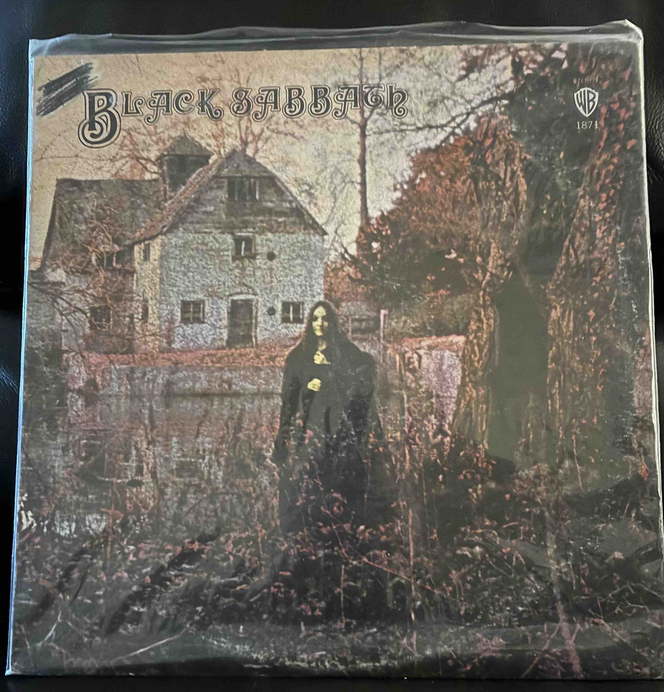

The very first album that I can recall listening to, Black Sabbath's self-titled debut that defined a genre, was released 55 years ago on February 13, 1970. I must've been about 5-6 years old when this album served as the soundtrack of my life as it was among my mother's favorite records along with The Rolling Stones' "Sticky Fingers" and Jethro Tull's "Aqualung". While both the Stones' and Jethro Tull's albums are very good, it's only "Black Sabbath" that still finds rotation in my home today. I can remember sitting on the floor of my grandparents' home soaking in the Devil's interval and trying not to look at (but feeling an eerie compulsion to) the terrifying figure[^ll] on the album cover. I can also remember buying the cassette version of this at my local Ames with my birthday money some number of years later. Even later still, I can remember playing a truncated version of "War Pigs" with a couple of college friends as a musical birthday card for my mother. Even today, the rain-soaked thunder rumbling intro followed by the heavily distorted tritone can still bring chills to my spine.

[^ll]: Everyone thinks that's Ozzy, but in fact [it's model Louisa Livingstone](https://www.rollingstone.com/music/music-features/black-sabbath-cover-art-keef-keith-macmillan-interview-951578/).
